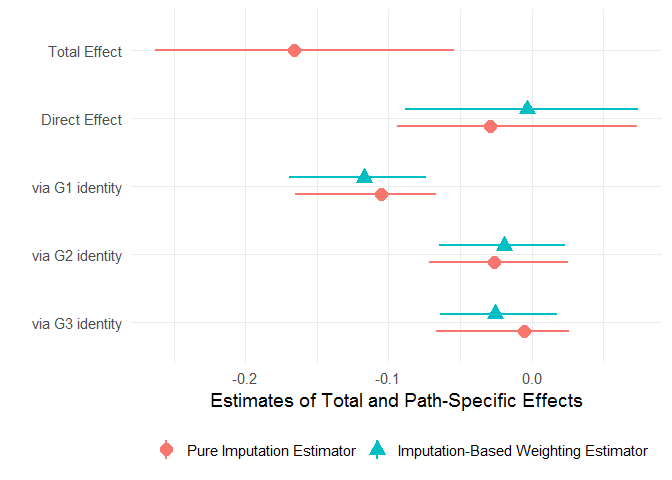
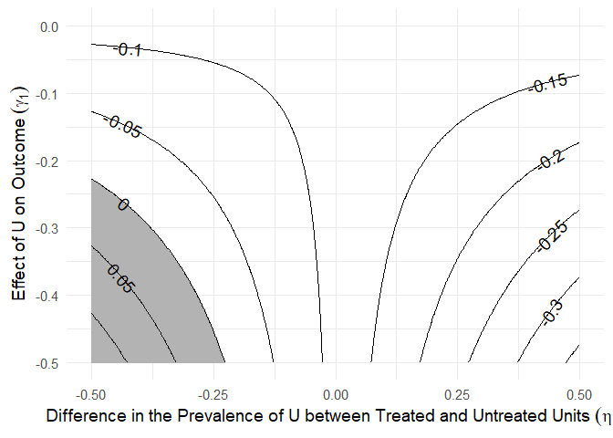

<!-- README.md is generated from README.Rmd. Please edit that file -->

# paths: An Imputation Approach to Estimating Path-specific Causal Effects

This package implements an imputation approach to estimating
path-specific effects (PSEs) in causal mediation analysis ([Zhou and
Yamamoto 2020](https://osf.io/2rx6p)). Estimation uncertainty is
assessed using the nonparametric bootstrap.

## Installation

You can install the released version of paths from
[CRAN](https://CRAN.R-project.org) with:

``` r
install.packages("paths")
```

And the development version from [GitHub](https://github.com/) with:

``` r
# install.packages("devtools")
devtools::install_github("mdtrinh/paths")
```

## Estimating Path-specific Effects (PSEs)

Given a binary treatment *A*, an outcome of interest *Y*, a set of
pretreatment confounders *X*, and *K* causally ordered (possibly
vector-valued) mediators *M<sub>1</sub>*,
*M<sub>2</sub>*,…*M<sub>K</sub>*, the average total effect of the
treatment on the outcome can be decomposed into *K+1* PSEs that
represent the causal paths *A* → *M<sub>1</sub>* ⤳ *Y*, *A* →
*M<sub>2</sub>* ⤳ *Y*,… *A* → *M<sub>K</sub>* → *Y*, and *A* → *Y*,
where the straight arrow → denotes a direct path and the squiggly arrow
⤳ represents a combination of all direct and indirect paths. These
effects are nonparametrically identified under standard ignorability
assumptions ([Avin, Shpitser and
Pearl 2005](https://escholarship.org/content/qt45x689gq/qt45x689gq.pdf)).

The `paths` function estimates these PSEs using an imputation approach,
which requires the user to provide *K+1* outcome models that
characterize E\[*Y* | *X*, *A*\], E\[*Y* | *X*, *A*, *M<sub>1</sub>*\],
…E\[*Y* | *X*, *A*, *M<sub>K</sub>*\], respectively. These outcome
models can be objects returned by `lm`, `glm`, `gbm::gbm`,
`BART::pbart`, or `BART::wbart`. Below is an example illustrating the
use of `paths` to estimate the direct and indirect effects of ancestor
victimization on descendants’ political attitudes. The original data
come from [Lupu and Peisakhin
(2017)](https://doi.org/10.1111/ajps.12327).

``` r
library(paths)
library(gbm)

# K=3 causally ordered mediators
m1 <- c("trust_g1", "victim_g1", "fear_g1")
m2 <- c("trust_g2", "victim_g2", "fear_g2")
m3 <- c("trust_g3", "victim_g3", "fear_g3")
mediators <- list(m1, m2, m3)

# outcome model formulas
formula_m0 <- annex ~ kulak + prosoviet_pre + religiosity_pre + land_pre +
  orchard_pre + animals_pre + carriage_pre + otherprop_pre + violence
formula_m1 <- update(formula_m0,    ~ . + trust_g1 + victim_g1 + fear_g1)
formula_m2 <- update(formula_m1,    ~ . + trust_g2 + victim_g2 + fear_g2)
formula_m3 <- update(formula_m2,    ~ . + trust_g3 + victim_g3 + fear_g3)

# outcome models
gbm_m0 <- gbm(formula_m0, data = tatar, distribution = "bernoulli",
              interaction.depth = 3)
gbm_m1 <- gbm(formula_m1, data = tatar, distribution = "bernoulli",
              interaction.depth = 3)
gbm_m2 <- gbm(formula_m2, data = tatar, distribution = "bernoulli",
              interaction.depth = 3)
gbm_m3 <- gbm(formula_m3, data = tatar, distribution = "bernoulli",
              interaction.depth = 3)
gbm_ymodels <- list(gbm_m0, gbm_m1, gbm_m2, gbm_m3)

# causal paths analysis using gbm
tatar_paths <- paths(a = "violence", y = "annex", m = mediators,
  gbm_ymodels, data = tatar, nboot = 250)

# summarize results
summary(tatar_paths)
#> 
#> Causal Paths Analysis 
#> 
#> Call: paths(a = "violence", y = "annex", m = mediators, models = gbm_ymodels, 
#>     data = tatar, nboot = 250)
#> 
#> Treatment: violence 
#> Outcome: annex 
#> 
#> Outcome model: annex ~ kulak + prosoviet_pre + religiosity_pre + land_pre + 
#>     orchard_pre + animals_pre + carriage_pre + otherprop_pre + 
#>     violence
#> <environment: 0x000000001fd2b5c8>
#> 
#> Mediator 1 :  trust_g1 + victim_g1 + fear_g1 
#> Mediator 2 :  trust_g2 + victim_g2 + fear_g2 
#> Mediator 3 :  trust_g3 + victim_g3 + fear_g3 
#> 
#> Causal Paths Estimates: 
#> 
#> Pure Imputation Estimator: 
#> Type 1 Decomposition: 
#>                               Estimate Std. Err. 95% CI Lower 95% CI Upper
#> Direct Effect: A -> Y            0.007     0.038       -0.089        0.054
#> Indirect Effect: A -> M3 -> Y   -0.037     0.024       -0.068        0.020
#> Indirect Effect: A -> M2 ~> Y   -0.025     0.024       -0.073        0.022
#> Indirect Effect: A -> M1 ~> Y   -0.114     0.025       -0.163       -0.068
#> Total Effect: A ~> Y            -0.169     0.051       -0.277       -0.077
#>                               P-value    
#> Direct Effect: A -> Y           0.960    
#> Indirect Effect: A -> M3 -> Y   0.384    
#> Indirect Effect: A -> M2 ~> Y   0.328    
#> Indirect Effect: A -> M1 ~> Y  <2e-16 ***
#> Total Effect: A ~> Y           <2e-16 ***
#> ---
#> Signif. codes:  0 '***' 0.001 '**' 0.01 '*' 0.05 '.' 0.1 ' ' 1
#> 
#> Type 2 Decomposition: 
#>                               Estimate Std. Err. 95% CI Lower 95% CI Upper
#> Direct Effect: A -> Y           -0.030     0.035       -0.119        0.014
#> Indirect Effect: A -> M3 -> Y   -0.029     0.023       -0.070        0.018
#> Indirect Effect: A -> M2 ~> Y   -0.018     0.024       -0.065        0.026
#> Indirect Effect: A -> M1 ~> Y   -0.093     0.030       -0.152       -0.034
#> Total Effect: A ~> Y            -0.169     0.051       -0.277       -0.077
#>                               P-value    
#> Direct Effect: A -> Y            0.20    
#> Indirect Effect: A -> M3 -> Y    0.36    
#> Indirect Effect: A -> M2 ~> Y    0.52    
#> Indirect Effect: A -> M1 ~> Y  <2e-16 ***
#> Total Effect: A ~> Y           <2e-16 ***
#> ---
#> Signif. codes:  0 '***' 0.001 '**' 0.01 '*' 0.05 '.' 0.1 ' ' 1
#> 
#> 
#> Sample size: 427 
#> 
#> Number of bootstrap simulations: 250
```

## An Imputation-based Weighting Estimator

The same PSEs can be alternatively estimated using an imputation-based
weighting estimator detailed in [Zhou and Yamamoto
(2020)](https://osf.io/2rx6p). To implement this estimator, the user
needs to additionally supply a propensity score model for the treatment,
which can be objects returned by `glm`, `gbm::gbm`. `twang::ps`, or
`BART::pbart`.

``` r
# propensity score model via gbm
formula_ps <- violence ~ kulak + prosoviet_pre +
  religiosity_pre + land_pre + orchard_pre + animals_pre +
  carriage_pre + otherprop_pre
gbm_ps <- gbm(formula_ps, data = tatar, distribution = "bernoulli",
              interaction.depth = 3)

# causal paths analysis using both the pure imputation estimator and the imputation-based weighting estimator
tatar_paths2 <- paths(a = "violence", y = "annex", m = mediators,
  ps_model = gbm_ps, gbm_ymodels, data = tatar, nboot = 250)
```

## Plotting PSEs

The `plot.paths` method can be used to visualize the total and
path-specific causal effects estimated by `paths`.

``` r
plot(tatar_paths2, mediator_names = c("G1 identity", "G2 identity", "G3 identity"),
     estimator = "both")
```



## Sensitivity Analysis

The `sens()` function implements a set of bias formulas detailed in
[Zhou and Yamamoto (2020)](https://osf.io/2rx6p) for assessing the
sensitivity of estimated PSEs to an unobserved confounder U of a
mediator-outcome relationship. The user provides a fitted `paths`
object, the mediator whose relationship with the outcome is potentially
confounded, the estimand whose sensitivity to unobserved confounding is
being investigated, type of estimator, type of decomposition, and
possible values of the sensitivity parameters γ and η.

The object returned by the `sens()` function is a list containing (a)
the original estimate of the corresponding PSE, and (b) a data frame
where each row represents a potential combination of γ and η, the
corresponding bias, bias-adjusted estimate, and an indicator for whether
the bias-adjusted estimate is of the opposite sign to the original
estimate.

The `plot.sens()` function visualizes the sensitivity analysis by
showing contours of bias-adjusted estimates under different values of γ
and η.

``` r
# sensitivity analysis for the path-specific effect via M1
sens_paths <- sens(tatar_paths, confounded = "M1", estimand = "via M1",
  gamma_values = - seq(0, 0.5, 0.002), eta_values = seq(-0.5, 0.5, 0.002))

plot(sens_paths)
```



## Experimental Data

In experimental data where treatment is randomly assigned, the pure
imputation estimator and the imputation-based weighting estimator are
equivalent, so that a propensity score model for the treatment is not
needed. In addition, because the treatment-outcome relationship is not
confounded, the pretreatment covariates *X* can be omitted from the
baseline model. Below is an example illustrating the use of `paths` to
estimate the direct and indirect effects of issue framing on citizens’
support for welfare reform
([Slothuus 2008](https://doi.org/10.1111/j.1467-9221.2007.00610.x)). In
this example, the treatment (issue framing) has been randomly assigned
via a survey experiment so the baseline outcome model can be a simple
linear regression of *Y* on *A*.

``` r
# variable names
x <- c("gender1", "educ1", "polint1", "ideo1", "know1", "value1")
a <- "ttt"
m1 <- c("W1", "W2")
m2 <- c("M1","M2","M3","M4","M5")
y <- "Y"
m <- list(m1, m2)

# formulas
form_m0 <- as.formula(paste0(y, "~", a))
form_m1 <- as.formula(paste0(y, "~", paste0(c(x, a, m1), collapse = "+")))
form_m2 <- as.formula(paste0(y, "~", paste0(c(x, a, m1, m2), collapse = "+")))

# baseline model for overall treatment effect
lm_m0 <- lm(form_m0, data = welfare)

# GBM outcome models
gbm_m1 <- gbm(form_m1, data = welfare, distribution = "gaussian",
              interaction.depth = 3)
gbm_m2 <- gbm(form_m2, data = welfare, distribution = "gaussian",
              interaction.depth = 3)
gbm_ymodels <- list(lm_m0, gbm_m1, gbm_m2)

# causal paths analysis
welfare_paths <- paths(a, y, m, models = gbm_ymodels,
                     data = welfare, nboot = 250)
```
